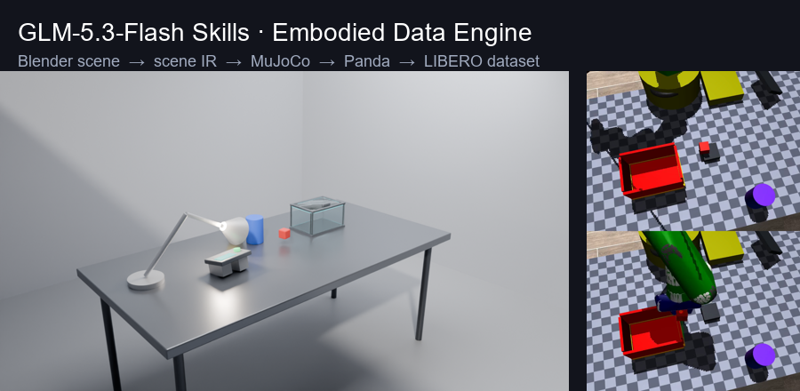

# GLM-5.3-Flash Skills · Embodied Data Engine

<p align="center">
  
</p>

**One agent skill that turns natural language into physically validated robot manipulation datasets — autonomously.**

GLM-5.3-Flash designs the scene, compiles it to MuJoCo, passes four validation gates, writes its own IK expert, and collects a LIBERO-compatible HDF5 dataset. No hand-fixes.

## ⚡ Quick Start

```bash
git clone https://github.com/hxwxss/glm-skills-embodied.git
cd glm-skills-embodied
pip install -r requirements.txt

# Full pipeline: scene IR → validate → grasp → collect dataset
python tasks/put_red_in_box/mujoco_env/run_pipeline.py --episodes 3
```

Requires Python 3.12. Headless-safe, no GUI needed.

Interactive Blender scene: open `pipeline/blender/embodied_lab.blend`, run `interaction.py` from the Scripting tab, press `N` → **Embodied Demo** panel.

## 🎬 Demos

| Task | Success | |
|---|---|---|
| **Put red cube in box** (reference) | 6/6 |  |
| **Green bottle in tray** | 8/8 |  |
| **Flip open the hinged lid** | 1/1 |  |
| **Two-tier sort** (lid + drawer + sort) | 1/1 |  |

▶ Full-quality videos in [`videos/`](videos/)

## 📊 Dataset

Every task ships a LIBERO-compatible HDF5 under [`data/`](data/):

```text
data/put_red_in_box/demo.hdf5
├─ attrs: instruction, model_file (full MJCF), env_args, success_rate
├─ actions       (T, 8)
├─ obs/
│  ├─ agentview_image  (T, 480, 640, 3)
│  ├─ robot0_eef_pos / quat / joint_pos / gripper_qpos
├─ states        (T, nq + nv)      ← full sim state, frame-accurate replay
└─ dones         (T,)
```

Verified by [`pipeline/verify_libero_compat.py`](pipeline/verify_libero_compat.py):
`model_file` compiles · `states` replay reproduces EE pose < 1 mm · `env_args` rebuilds via `robosuite.make` · terminal `dones=True`.

## 🧠 The Skill

[`skills/agentic-sim2data/SKILL.md`](skills/agentic-sim2data/SKILL.md) packages the
entire workflow as a reusable agent skill: pipeline stages, validation gates,
acceptance criteria, and a 26-entry pitfalls reference — every entry a real bug
from these builds.

Drop it into `~/.agents/skills/` and the agent can rerun the whole methodology
on any new scene or task.

## 📁 Repository

```text
├── skills/agentic-sim2data/        the skill (stages, gates, pitfalls)
├── tasks/
│  ├── put_red_in_box/mujoco_env/   reference task (run_pipeline.py)
│  ├── bottle_tray/                  bottle → tray (8 episodes)
│  ├── lid_open/                     revolute lid flip (preview)
│  └── two_tier_sort/                hinged lid + drawer (preview)
├── videos/                          MP4 recordings
├── data/                            per-task HDF5 datasets
├── images/                          GIFs, frames, banner
└── docs/
   ├── PIPELINE.md                   architecture & stage details
   ├── VALIDATION.md                 all defects caught by gates
   └── ITERATION_LOG.md              full debug history
```

## 📖 More

- [Pipeline architecture](docs/PIPELINE.md)
- [Validation gates — 26 defects found and fixed autonomously](docs/VALIDATION.md)
- [Full iteration log](docs/ITERATION_LOG.md)
- [Scene provenance](docs/PIPELINE.md#scene-provenance) — the MuJoCo scene was
  first prototyped in Blender, then exported as an IR and re-compiled

## 🔧 Requirements

Python 3.12 · MuJoCo 3.4 · robosuite 1.5.2 · mink · h5py · imageio

Headless-safe (offscreen rendering, no display required).
