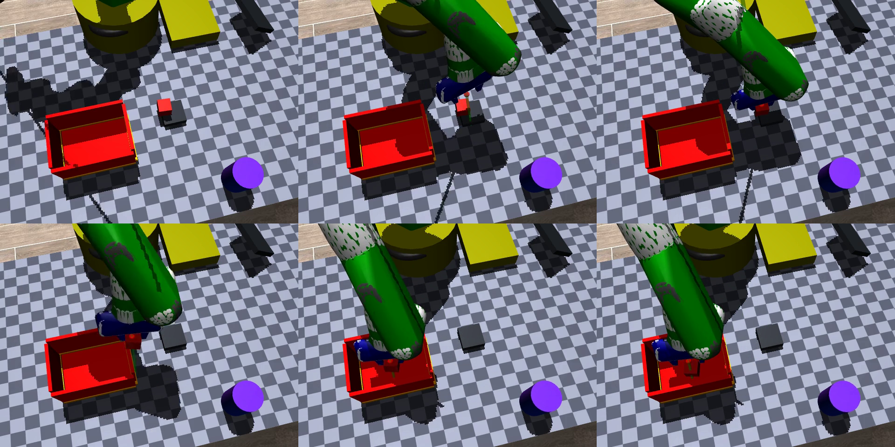

# GLM Embodied Data Skills

An agentic simulation-to-data workflow for tabletop robot manipulation. The
included skill turns a scene specification into a MuJoCo scene, validates
physics and reachability, runs a Panda pick-and-place expert, and writes a
LIBERO/robosuite-compatible HDF5 dataset.

The reference task is: **put the red cube into the transparent storage box**.
The project is intentionally small enough to inspect, rerun, and adapt to a
new scene.



## Demo / Videos

The repository includes three H.264/MP4 recordings. The teaser above gives a
quick visual overview; the players below expose the recordings directly on
this page where the GitHub renderer supports HTML5 video.

### Grasp demo

<video controls preload="metadata" playsinline width="640" poster="images/demo_hd_frames.png">
  <source src="videos/grasp_demo_hd.mp4" type="video/mp4">
  <a href="videos/grasp_demo_hd.mp4">Download or open the grasp demo</a>
</video>

### Supplementary video 01

<video controls preload="metadata" playsinline width="640">
  <source src="videos/supplementary_demo_01.mp4" type="video/mp4">
  <a href="videos/supplementary_demo_01.mp4">Download or open supplementary video 01</a>
</video>

### Supplementary video 02

<video controls preload="metadata" playsinline width="640">
  <source src="videos/supplementary_demo_02.mp4" type="video/mp4">
  <a href="videos/supplementary_demo_02.mp4">Download or open supplementary video 02</a>
</video>

If GitHub's Markdown sanitizer does not render the native players in your
browser, use the static gallery instead:

**[Open the video gallery](frontend/index.html)**

| Title | File | Format |
| --- | --- | --- |
| Grasp demo | [`videos/grasp_demo_hd.mp4`](videos/grasp_demo_hd.mp4) | 640 x 480, ~8.0 s |
| Supplementary video 01 | [`videos/supplementary_demo_01.mp4`](videos/supplementary_demo_01.mp4) | 640 x 480, ~6.0 s |
| Supplementary video 02 | [`videos/supplementary_demo_02.mp4`](videos/supplementary_demo_02.mp4) | 1280 x 480, ~29.4 s |

To view the gallery locally:

```bash
python -m http.server 8000
# Open http://localhost:8000/frontend/
```

## Project Overview

The [`agentic-sim2data` skill`](skills/agentic-sim2data/SKILL.md) documents the
reusable methodology and validation gates. The pipeline uses
[`pipeline/spec/scene_spec.json`](pipeline/spec/scene_spec.json) as its single
source of truth:

```text
scene spec -> MJCF compile -> physics check -> reachability check
            -> robosuite reset test -> IK expert -> penetration audit
            -> HDF5 demo collection
```

The included dataset is [`data/demo.hdf5`](data/demo.hdf5) (about 53 MB). It
contains six recorded episodes with images, robot state, actions, done flags,
and a snapshot of the scene specification.

## Setup

Requires Python 3.12 and MuJoCo/robosuite dependencies:

```bash
python -m venv .venv
source .venv/bin/activate       # Windows: .venv\\Scripts\\activate
python -m pip install --upgrade pip
python -m pip install mujoco robosuite robosuite-models mink h5py imageio pillow
```

The included pipeline does **not** require an API key or network credential.
For optional integrations, copy [`.env.example`](.env.example) to `.env` and
provide values locally. Never commit `.env`; only placeholder variable names
belong in documentation or examples.

Run the end-to-end pipeline from the repository root:

```bash
python pipeline/run_pipeline.py --episodes 6 --collect-episodes 6
```

Useful individual checks:

```bash
python pipeline/compile_mjcf.py
python pipeline/test_mjcf_physics.py
python pipeline/check_reachability.py
python pipeline/task_put_red_in_box.py --reset-test 10
python pipeline/expert_ik.py test --episodes 6
python pipeline/test_penetration.py
```

Generated renders are written under `renders/` and are ignored by Git.

## Public / Security Note

- Public: the scene specification, simulator code, skill documentation,
  validation logic, dataset schema, and the three demo videos.
- Not public: API keys, tokens, passwords, private keys, database URLs, or
  internal endpoints. None are required by the checked-in pipeline, and no
  credential was found in tracked source, configuration, notebooks, logs, or
  sample outputs during the release audit.
- Server-side only: any future provider credential must be read from an
  environment variable at process start and used in a server-side process.
  Do not put it in `frontend/`, browser JavaScript, or a public build.
- Safe frontend configuration: non-secret display settings such as video
  paths, labels, and public feature flags may be shipped to the browser.

The local Git reflog contains the original clone author metadata, which is not
part of the tracked project files. Commit history was not rewritten as part of
this cleanup; review or rewrite author metadata separately if your publishing
policy requires it.

## Repository Map

```text
├── frontend/                    static video gallery
├── videos/                      three browser-playable MP4 demos
├── data/demo.hdf5               LIBERO/robosuite-style dataset
├── images/demo_hd_frames.png    demo frame contact sheet
├── pipeline/
│   ├── spec/scene_spec.json     scene IR (single source of truth)
│   ├── compile_mjcf.py          IR -> MuJoCo scene
│   ├── task_put_red_in_box.py   robosuite task wrapper
│   ├── expert_ik.py             mink IK expert
│   ├── collect_demos.py         HDF5 dataset writer
│   ├── test_*.py                physics and penetration checks
│   └── run_pipeline.py          one-command pipeline runner
└── skills/agentic-sim2data/     reusable skill and pitfalls reference
```

## License

No license file is currently included. Add the license that matches your
intended public distribution before publishing a release.
