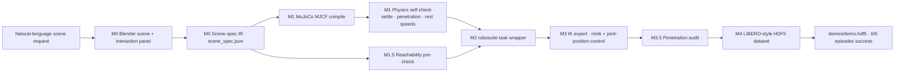

# GLM-5.3-Flash Skills · Embodied

**A coding-agent skill + pipeline that turns a natural-language scene request into a physically validated robot manipulation dataset.**

We asked GLM-5.3-Flash to do embodied-AI data engineering end to end: design the scene in Blender, export a scene-spec IR, compile it to MuJoCo, pass physics / reachability / penetration validation gates, write its own IK expert, and produce a LIBERO-style HDF5 dataset — autonomously.


*Click the player above to watch. Fallback: [`videos/grasp_demo_hd.mp4`](videos/grasp_demo_hd.mp4)*

## The demo

**Task:** `put the red cube into the transparent storage box` (Franka Panda, tabletop)


▶ **Full video:** [`videos/grasp_demo_hd.mp4`](videos/grasp_demo_hd.mp4) — 640×480 @ 20 fps

## Pipeline



Every arrow is a **validation gate**. A failed gate blocks the pipeline and
forces a design fix — rerun everything end to end after each fix.

## What the agent caught on its own

No human fixed anything by hand. Every defect below was found by an automated
validation gate, then fixed in the scene IR, then the whole pipeline reran:

| # | Found by | Defect | Fix |
|---|---|---|---|
| 1 | Gripper-aperture check | 7 cm cube > 5.9 cm measured gripper aperture — physically ungraspable | cube resized to 5 cm |
| 2 | Reachability pre-check | all objects 1.57 m from base (arm reach 0.855 m) | task zone re-laid out |
| 3 | Action-range inspection | env silently clipped actions to ±1 — joint angles & world targets truncated | controller ranges opened to physical units |
| 4 | Gripper telemetry | fingers never closed: gripper command written to wrong action dim (6 instead of 7) | index fixed |
| 5 | Top-down camera render | transparent box invisible against checkerboard (color collision) | orange translucent walls + bold rim outline |
| 6 | Penetration audit | distractor ball smashed 19.6 mm through the floor during settle | distractor made static |
| 7 | Camera composition | featureless white table read as a wall — scene looked upside down | near-vertical top-down camera + checkerboard table texture |

Full log: [`docs/ITERATION_LOG.md`](docs/ITERATION_LOG.md).

## Results

| Stage gate | Result |
|---|---|
| Physics self-check (settle / penetration / rest) | PASS |
| Reachability pre-check | PASS (all task objects within 0.78 m) |
| Reset-distribution test (20 resets) | PASS |
| IK expert success rate | **6/6 → 10/10 = 100%** (multiple runs) |
| Penetration audit | PASS (max contact depth 4.1 mm = solver noise) |
| Dataset | 6 episodes, 6/6 success, ~157 steps each |

## Dataset

[`data/demo.hdf5`](data/demo.hdf5) (53 MB) — LIBERO/robosuite-compatible:

```text
data/demo_i
├─ attrs: num_samples, success, instruction
│         "put the red cube into the transparent storage box"
├─ actions            (T, 8)   absolute joint targets (7) + gripper (1)
├─ obs/
│  ├─ agentview_image (T, 480, 640, 3)
│  ├─ robot0_eef_pos / quat / joint_pos / gripper_qpos
└─ dones              (T,)
```

Top-level attrs embed the full scene-spec IR, so every episode is independently
reconstructible. LeRobot/RLDS conversion is a straightforward next step.

## Repository map

```text
├── skills/agentic-sim2data/   ★ the skill (SKILL.md + 18-entry pitfalls reference)
├── videos/grasp_demo_hd.mp4   demo video
├── data/demo.hdf5             dataset (6 episodes, 53 MB)
├── images/                    MuJoCo demo frames + Blender (M0) three-camera renders
├── pipeline/
│  ├── blender/               scene builder + interactive panel + .blend
│  ├── spec/scene_spec.json   ★ the IR contract (single source of truth)
│  └── mujoco_env/            compile · task · IK expert · validators · collection
└── docs/
   ├── PIPELINE.md            full pipeline documentation
   └── ITERATION_LOG.md       Blender iterations + pipeline debug log
```

## Run it yourself

```bash
# Blender scene (interactive N-panel demo + scene-spec export)
blender --background --factory-startup --python pipeline/blender/build_scene.py

# MuJoCo backend: compile + validate + grasp + collect
cd pipeline/mujoco_env
python run_pipeline.py --episodes 6 --collect-episodes 6
```

Requires: Blender 5.2+, Python 3.12, `pip install mujoco robosuite robosuite-models mink h5py imageio`.

For the interactive Blender scene: open `pipeline/blender/embodied_lab.blend`,
run `interaction.py` from the Scripting tab (or launch with
`--python interaction.py`), press `N` → **Embodied Demo** panel.

## The skill

[`skills/agentic-sim2data/`](skills/agentic-sim2data/SKILL.md) packages this
entire workflow as a reusable agent skill: pipeline stages, validation gates,
acceptance criteria, and an 18-entry pitfalls reference — every entry a real
bug from this build. Drop it into `~/.agents/skills/` and the agent can rerun
the whole methodology on a new scene or task.

## Roadmap

- [ ] MimicGen-style amplification: keypoints re-anchored per episode → 8 seeds → hundreds of trajectories
- [ ] LeRobot conversion + SmolVLA/ACT fine-tuning loop on `demo.hdf5`
- [ ] More articulated tasks: prismatic drawer, hinged cabinet door (IR joint schema ready)
- [ ] Domain randomization: spec-driven batch scene variants
- [ ] Isaac Sim backend compiled from the same IR

---

*Built autonomously by GLM-5.3-Flash as a coding agent. Human input: the task
idea and design review. Zero hand-fixes to scene, code, or data.*
