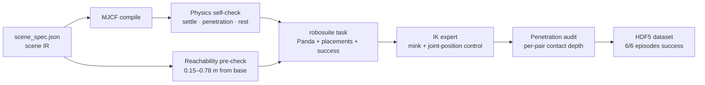

# GLM-5.3-Flash Skills · Embodied Data Engine

**A coding-agent skill + pipeline that turns a natural-language scene request
into a physically validated robot manipulation dataset.**

GLM-5.3-Flash autonomously designed the scene, compiled it to MuJoCo, passed
four validation gates, wrote its own IK expert, and produced a
LIBERO/robosuite-compatible HDF5 dataset — with zero hand-fixes.


▶ Full video: [`videos/grasp_demo_hd.mp4`](videos/grasp_demo_hd.mp4)
(640×480 @ 20 fps)

## Task

`put the red cube into the transparent storage box`
(Franka Panda, tabletop, randomized cube position ±4 cm)

## Pipeline



Every arrow is a **validation gate**. A failed gate blocks the pipeline and
forces a design fix in the scene IR — then everything reruns.

## What the agent caught on its own

No human fixed anything by hand. Every defect below was found by an automated
validation gate, then fixed in the scene IR, then the whole pipeline reran:

| # | Found by | Defect | Fix |
|---|---|---|---|
| 1 | Gripper-aperture check | 7 cm cube > 5.9 cm measured gripper aperture — physically ungraspable | cube resized to 5 cm |
| 2 | Reachability pre-check | all objects 1.57 m from base (arm reach 0.855 m) | task zone re-laid out |
| 3 | Action-range inspection | env silently clipped actions to ±1 — joint angles & world targets truncated | controller ranges opened to physical units |
| 4 | Gripper telemetry | fingers never closed: gripper command written to wrong action dim (6 instead of 7) | index fixed |
| 5 | Top-down camera render | transparent box invisible against checkerboard (color collision) | orange translucent walls + bold rim outline |
| 6 | Penetration audit | distractor ball smashed 19.6 mm through the floor during settle | distractor made static |
| 7 | Camera composition | featureless white table read as a wall — scene looked upside down | near-vertical top-down camera + checkerboard table texture |

Full debug history: [`docs/ITERATION_LOG.md`](docs/ITERATION_LOG.md).

## Results

| Validation gate | Result |
|---|---|
| Physics self-check (settle / penetration / rest) | PASS |
| Reachability pre-check | PASS |
| Reset-distribution test (20 random resets) | PASS |
| IK expert success rate (randomized inits) | **6/6 → 10/10 = 100%** (multiple runs) |
| Penetration audit | PASS (max contact depth 4.1 mm = solver noise) |
| Dataset | 6 episodes, 6/6 success, ~157 steps each |

## Dataset

[`data/demo.hdf5`](data/demo.hdf5) (53 MB) — LIBERO/robosuite-compatible:

```text
data/demo_i
├─ attrs: num_samples, success, instruction
│         "put the red cube into the transparent storage box"
├─ actions            (T, 8)   absolute joint targets (7) + gripper (1)
├─ obs/
│  ├─ agentview_image (T, 480, 640, 3)
│  ├─ robot0_eef_pos / quat / joint_pos / gripper_qpos
└─ dones              (T,)
```

Top-level attrs embed the full scene-spec IR — every episode is independently
reconstructible. LeRobot/RLDS conversion is a straightforward next step.

## The skill

[`skills/agentic-sim2data/`](skills/agentic-sim2data/SKILL.md) packages this
entire workflow as a reusable agent skill: pipeline stages, validation gates,
acceptance criteria, and an 18-entry pitfalls reference — every entry a real
bug from this build. Drop it into `~/.agents/skills/` and the agent can rerun
the whole methodology on a new scene or task.

## Run it yourself

```bash
cd pipeline
python run_pipeline.py --episodes 6 --collect-episodes 6
```

Requires: Python 3.12, `pip install mujoco robosuite robosuite-models mink
h5py imageio`. Headless-safe (offscreen rendering, no GUI needed).

## Repository map

```text
├── skills/agentic-sim2data/   ★ the skill (stages, gates, pitfalls)
├── videos/grasp_demo_hd.mp4   demo video
├── data/demo.hdf5             dataset (6 episodes, 53 MB)
├── images/demo_hd_frames.png  demo frames
├── pipeline/
│  ├── scene_spec.json         ★ scene IR (single source of truth)
│  ├── compile_mjcf.py         IR → MuJoCo scene
│  ├── task_put_red_in_box.py  robosuite task (Panda + placements + success)
│  ├── expert_ik.py            mink IK expert policy
│  ├── collect_demos.py        HDF5 dataset writer
│  ├── test_mjcf_physics.py · test_penetration.py · check_reachability.py
│  ├── run_pipeline.py         ★ one-command end-to-end
│  └── generated/lab_scene.xml compiled standalone scene
└── docs/
   ├── PIPELINE.md             full pipeline documentation
   └── ITERATION_LOG.md        Blender iterations + pipeline debug log
```

## Scene provenance

The tabletop scene was first authored as an interactive Blender build
(desk lamp, control panel, translucent storage box with rim lights, N-panel
demo controls). The scene IR in [`pipeline/scene_spec.json`](pipeline/scene_spec.json)
was exported from that build; the MuJoCo pipeline consumes the IR — logical
layout and physics are shared, visual styling is per-backend.

## Roadmap

- [ ] Articulated tasks: prismatic drawer, hinged box lid (IR joint schema)
- [ ] MimicGen-style amplification: keypoints re-anchored per episode → hundreds of trajectories
- [ ] LeRobot conversion + SmolVLA/ACT fine-tuning loop on `demo.hdf5`
- [ ] Domain randomization: spec-driven batch scene variants
- [ ] Isaac Sim backend compiled from the same IR

---

*Built autonomously by GLM-5.3-Flash as a coding agent. Human input: the task
idea and design review. Zero hand-fixes to scene, code, or data.*
