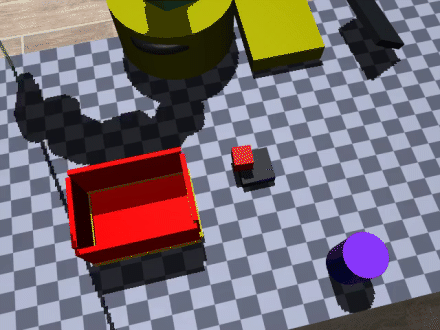
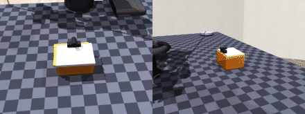
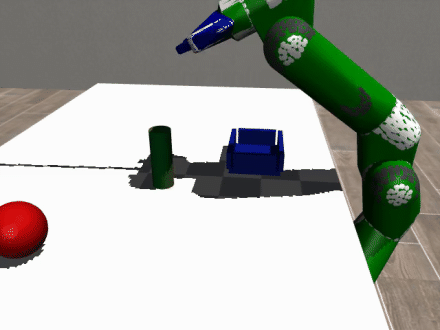
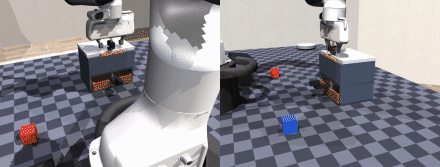
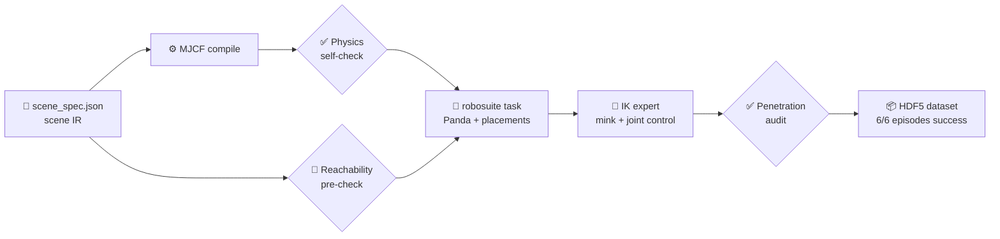

# GLM Embodied Data Skills

**One coding-agent skill that turns natural-language manipulation tasks into
physically validated MuJoCo scenes and LIBERO-style demonstration datasets.**

<p align="center">
  
  
</p>
<p align="center"><sub>Left: put the red cube in the box · Right: flip open the hinged lid</sub></p>

## The skill

[`skills/agentic-sim2data/`](skills/agentic-sim2data/SKILL.md) packages the
entire workflow as a reusable agent skill: pipeline stages, validation gates,
acceptance criteria, and a pitfalls reference — every entry a real bug from
these builds. Drop it into `~/.agents/skills/` and the agent can rerun the
whole methodology on a new scene or task.

One command reruns the whole methodology on this task:
`cd pipeline && python run_pipeline.py` — headless-safe, no GUI needed.


## Tasks

| Task | Instruction | Joint type | |
|---|---|---|---|
| [`pipeline/` put-red-in-box](pipeline/) | put the red cube into the transparent storage box | — (free objects) |  |
| [`tasks/bottle_tray`](tasks/bottle_tray/) | put the green bottle in the tray | — (novel objects: bottle + tray) |  |
| [`tasks/lid_open`](tasks/lid_open/) | flip open the lid of the storage box and leave it open | **revolute hinge** |  |
| [`tasks/two_tier_sort`](tasks/two_tier_sort/) | open the lid, pull out the drawer, put the red cube in the upper compartment and the blue cube in the drawer, then close the drawer and the lid again | **revolute + prismatic, long-horizon** |  |

*Single-episode tasks are preview builds — the policies and validation gates
are complete, dataset scaling is in progress.*


## Pipeline

Every arrow is a **validation gate** — a failed gate blocks the pipeline,
forces a design fix in the scene IR, then everything reruns.




## Defects caught by validation gates

Defects found by automated validation gates, fixed in the scene IR, followed
by a full pipeline rerun:

| # | Found by | Defect | Fix |
|---|---|---|---|
| 1 | Gripper-aperture check | 7 cm cube > 5.9 cm measured gripper aperture — physically ungraspable | cube resized |
| 2 | Reachability pre-check | all objects 1.57 m from base (arm reach 0.855 m) | task zone re-laid out |
| 3 | Action-range inspection | env silently clipped actions to ±1 — joint angles & world targets truncated | controller ranges opened to physical units |
| 4 | Gripper telemetry | fingers never closed: gripper command written to wrong action dim (6 instead of 7) | index fixed |
| 5 | Top-down camera render | transparent box invisible against checkerboard (color collision) | orange translucent walls + bold rim outline |
| 6 | Penetration audit | distractor ball smashed 19.6 mm through the floor during settle | distractor made static |
| 7 | Camera composition | featureless white table read as a wall — scene looked upside down | near-vertical top-down camera + checkerboard table texture |


## Dataset

Every task ships its own HDF5 in LIBERO/robosuite-compatible schema
(see [`data/demo.hdf5`](data/demo.hdf5)):

```text
data/demo_i
├─ attrs: num_samples, success, instruction
├─ actions            (T, action_dim)
├─ obs/
│  ├─ agentview_image (T, H, W, 3)
│  ├─ robot0_eef_pos / quat / joint_pos / gripper_qpos
└─ dones              (T,)
```

Top-level attrs embed the full scene-spec IR — every episode is independently
reconstructible.

## Repository map

```text
├── skills/agentic-sim2data/        ★ the skill (stages, gates, pitfalls)
├── pipeline/                       put-red-in-box (reference task)
│  ├── scene_spec.json              ★ scene IR
│  └── run_pipeline.py · task · expert_ik · validators · collect
├── tasks/
│  ├── bottle_tray/                 bottle → tray (8 eps)
│  ├── lid_open/                    revolute lid flip (preview)
│  └── two_tier_sort/               hinged lid + drawer long-horizon (preview)
├── videos/                          full-quality MP4 recordings
├── data/demo.hdf5                   reference-task dataset
├── images/                          demo GIFs & frames
└── docs/                            PIPELINE.md · ITERATION_LOG.md
```
